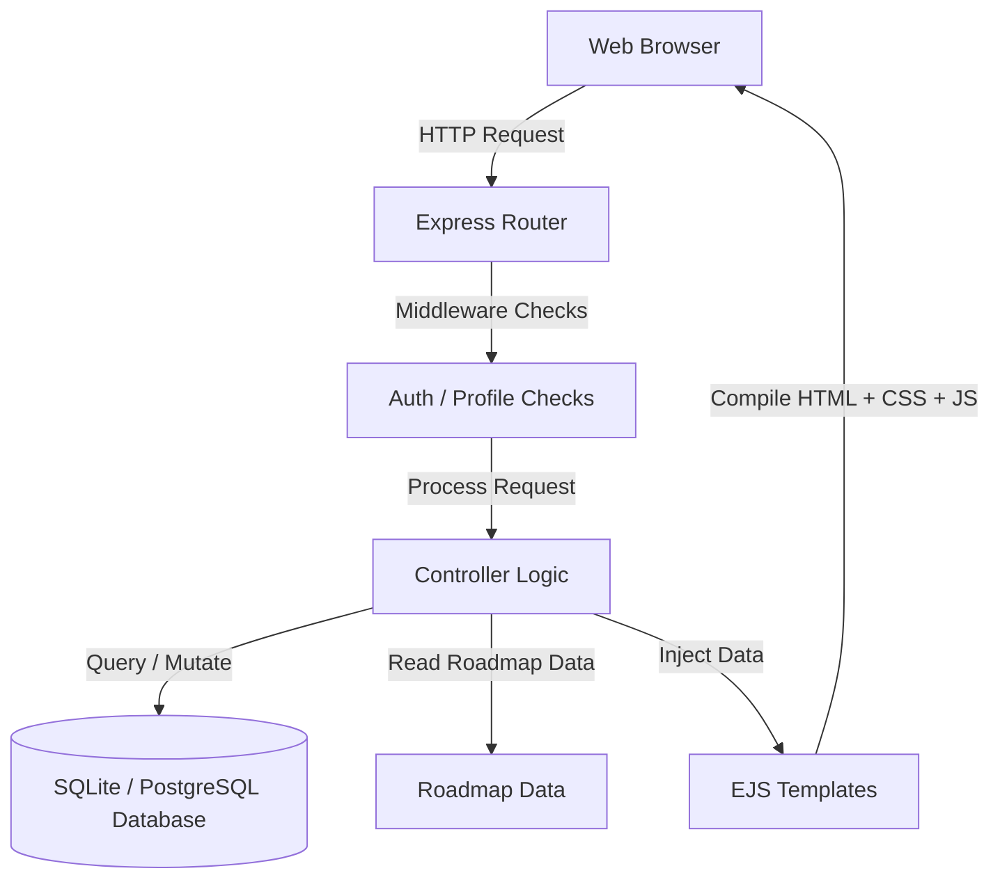

# CampusCompass System Architecture

This document describes the architectural layout, data structures, and request flows of the CampusCompass Phase 1 implementation. It serves as a guide for contributors to understand how different components interact.

---

## 🗺️ Architectural Overview

CampusCompass is built as a monolithic web application using the **MVC (Model-View-Controller)** pattern. This keeps the separation of concerns clear and simple for beginners to contribute to.



1. **Client**: Renders HTML/CSS templates, handles basic UI interactions (mobile menu toggle, FAQ accordions), and sends HTTP requests.
2. **Express Router**: Receives HTTP request calls and routes them to specific controller functions.
3. **Middleware**: Enforces access rules:

   * Blocks guest users from seeing private dashboards.
   * Redirects uncompleted profiles to the onboarding setup page.
   * Binds global session status variables (`isLoggedIn`) to the client environment.
4. **Controllers**: Houses the main business logic (validating inputs, calculating roadmap progress, reading data, and resolving database queries).
5. **Models**: Defines the database structure using Sequelize models, including fields, validations, and relationships.
6. **Views**: Serves pre-compiled HTML layouts.

---

## 🗄️ Database Architecture

The application uses Sequelize ORM for database management and data persistence.

### Development Environment

The default database for development is SQLite. SQLite stores data locally and requires minimal configuration, making it suitable for development and testing.

### Production Environment

For production deployments, the application can be configured to use PostgreSQL. Sequelize provides a consistent interface across supported database systems, allowing the application to switch databases with minimal code changes.

### Database Configuration

Database connections are configured through `config/db.js`, which initializes Sequelize and manages environment-specific settings.

### Models

Database tables are defined using Sequelize models. Each model represents a table and specifies its fields, validations, and relationships.

### Database Initialization

The application initializes the database using:

```javascript
sequelize.sync();
```

This command automatically creates the required tables based on the defined Sequelize models and keeps the database schema aligned with the application's data models.

### Data Storage

Application data is stored in relational database tables rather than JSON files. Sequelize handles data persistence, querying, validation, and schema management through its ORM layer.

---

## 🛣️ Middleware & Routing Pipeline

The routing pipeline uses session validation cookies (`express-session`) to check user login status.

### 1. Registration & Authentication Flow

* User registers (`POST /register`). The password is encrypted, user data is stored in the database, and `req.session.userId` is initialized.
* User is automatically redirected to `/profile/setup` since `isProfileComplete` is `false`.

### 2. Dashboard Rendering & Progress Math

When a student requests `/dashboard`:

1. `ensureProfileComplete` middleware checks if `req.session.userId` exists and if the user's profile is populated.
2. The controller loads the career path roadmap data matching the student's selected career (for example, web developer).
3. The controller parses the student's `skills` array.
4. The controller runs a matching function comparing student skills with roadmap topics.
5. Topics containing words matching user skills are marked as completed.
6. Completion percentage is calculated using completed topics divided by total topics.
7. EJS compiles the timeline cards and renders the dashboard.

---

## 📂 File System Layout & Modularity

* `app.js`: System bootstrap, middleware setup, database initialization, and server execution.
* `config/db.js`: Configures and initializes the Sequelize database connection.
* `data/roadmaps/`: Holds roadmap data used by the application.
* `routes/`: Translates URI endpoints into actions.
* `controllers/`: Controls application flow and business logic.
* `models/`: Defines Sequelize models and database relationships.
* `views/partials/`: Layout components to avoid code duplication across templates.
* `public/`: Public-facing styling and interactive JavaScript files.
